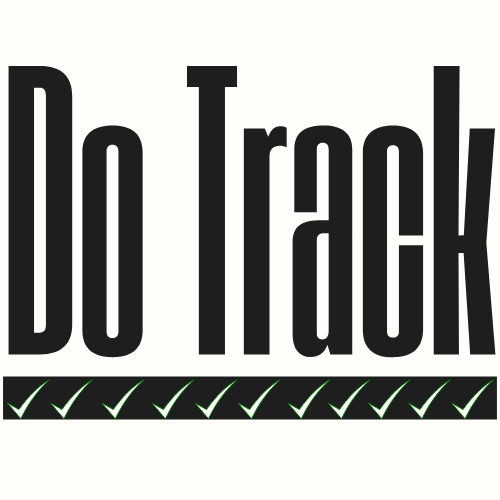
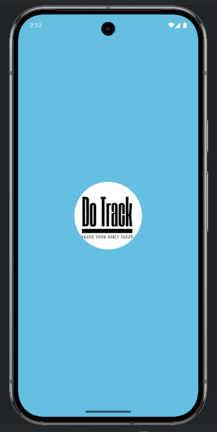
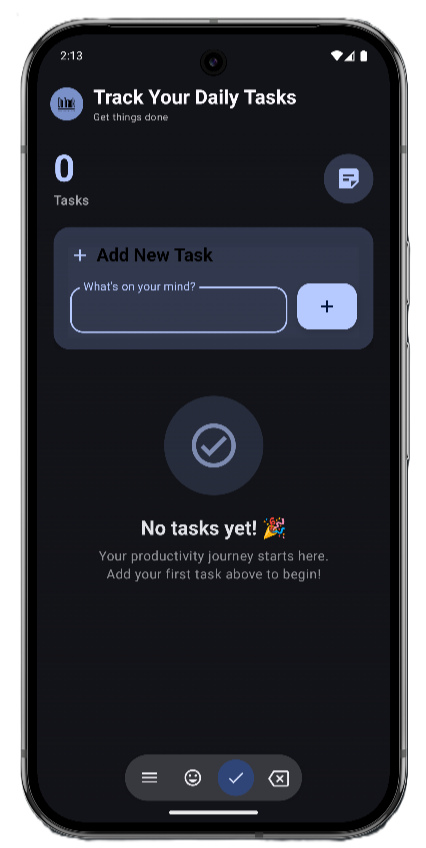
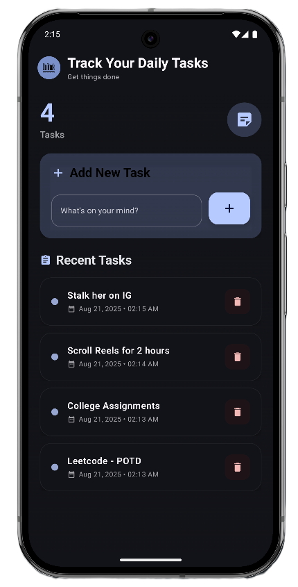

# ✅ DoTrack - Track Your Daily Tasks

  
    
  
  
  
  
  
   
  
  **A clean and simple ToDo Android app built with Jetpack Compose**
  

---

## ✨ Features

| ✅ Task Management | 📱 Modern UI | 💾 Data Storage |
|:---:|:---:|:---:|
| Add, edit, delete tasks | Clean Jetpack Compose | Room Database |

| 🎯 Simple Design | 📋 Task Organization | 🚀 Performance |
|:---:|:---:|:---:|
| Intuitive interface | Manage all tasks | Fast & responsive |

## 🛠️ Tech Stack

| Frontend | Architecture | Database |
|:---:|:---:|:---:|
| Jetpack Compose | MVVM Pattern | Room Database |
| Material 3 UI | Clean Architecture | Local Storage |

## 📱 Screenshots

### 📲 App Screens Overview

<table>
  <tr>
    <td align="center">
      
        
      <strong>🌟 Splash Screen</strong>
       
      <em>Welcome to DoTrack</em>
    </td>
    <td align="center">
      
        
      <strong>➕ Add Tasks</strong>
       
      <em>Create new tasks easily</em>
    </td>
    <td align="center">
      
        
      <strong>📋 All Tasks</strong>
       
      <em>Manage your todo list</em>
    </td>
  </tr>
</table>

## 🚀 Quick Start Guide

### 📋 Prerequisites

| Requirement | Version |
|:---:|:---:|
| **Android Studio** | Flamingo+ |
| **Min SDK** | 24 (Android 7.0) |
| **Storage** | Local database only |

### 🔧 Installation Steps

| Step | Action | Command/Location |
|:---:|:---:|:---:|
| **1** | 📥 **Clone Repository** | `git clone https://github.com/aviirajsharma/DoTrack.git` |
| **2** | 🔧 **Setup Dependencies** | Sync project in Android Studio |
| **3** | 🏗️ **Build Project** | Clean and rebuild |
| **4** | ▶️ **Run App** | Build and run on device/emulator |

## 🏆 Key Highlights

| 🎯 Clean Architecture | 🚀 Modern Tech Stack | 🎨 Beautiful UI |
|:---:|:---:|:---:|
| MVVM Pattern | Latest Android APIs | Material 3 Design |
| Separation of Concerns | Jetpack Compose | Intuitive Navigation |
| Testable Code | Kotlin Coroutines | Smooth Animations |

## 🚦 Getting Started

1. **📱 Install the app** on your Android device
2. **➕ Add new tasks** using the add button
3. **✅ Mark tasks** as complete when done
4. **🗑️ Delete tasks** you no longer need
5. **📋 View all tasks** in one organized list

---

   
  
  ### ✅ **Made with ❤️ for productivity enthusiasts** 📋
  
   
  
  **⭐ Star this repository if you find it helpful! ⭐**
  
   
  
  
  
  

